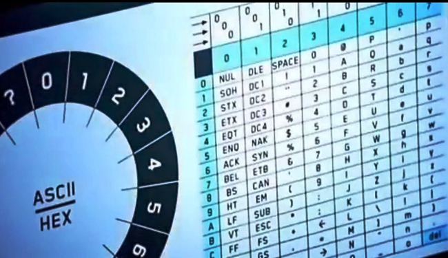
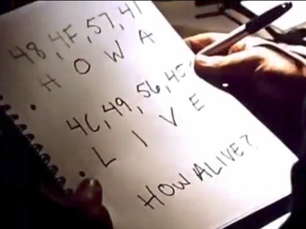

# JavaScript Challenge

In the 2015 science-fiction film **The Martian** an astronaut named Mark Watney becomes stranded on Mars after a terrible accident.

In order to survive long enough to be rescued Mark Watney must solve a series of challenges.  This JavaScript challenge re-creates one of those challenges from the film.

## Watney Decoder

Before he can be rescued Watney must find a way to communicate with earth.  During the accident the normal communications equipment was destroyed - but Mark has found a piece of scientific equipment with a camera capable of transmitting photos to Earth.

Mark can communicate with earth by writing down messages and showing them to the camera, but NASA has difficulties responding.

Luckily the camera is remote controlled and can spin 360 degrees.  He devises a way to allow NASA to encode and send messages.

His initial idea is to place a series of cards with each letter of the alphabet around the camera, which would allow NASA to point the camera and spell words.  With 26 letters in the alphabet, there would only be 13 degrees of arc between each letter, making it difficult to know which card the camera is actually pointed at.


He decides to solve this problem in the following way.

1) Instead of using letters - encode each letter using the [ASCII encoding standard](http://www.asciitable.com/).

2) Instead of encoding them in decimal numbers, encode them in hexadecimal.



## Your challenge

Run ```npm install``` from the command line to install the dependencies.

Edit the file `watneyDecoder.js` and implement the following functions

- encode: converts string to ASCII-Hex
- decode: converts ASCII-HEX to string
- encodeArc: convers a string to the proper degrees of arc to point the camera.

Run the **tests** with ```npm test``` and get all the tests to pass.



## Hints

Knowing how to do the following in JavaScript will help you more easily complete this challenge

- Converting characters to ASCII and back.
- Converting from decimal numbers to hexadecimal numbers.
- Using the JavaScript String methods
- Using High-Order Functions